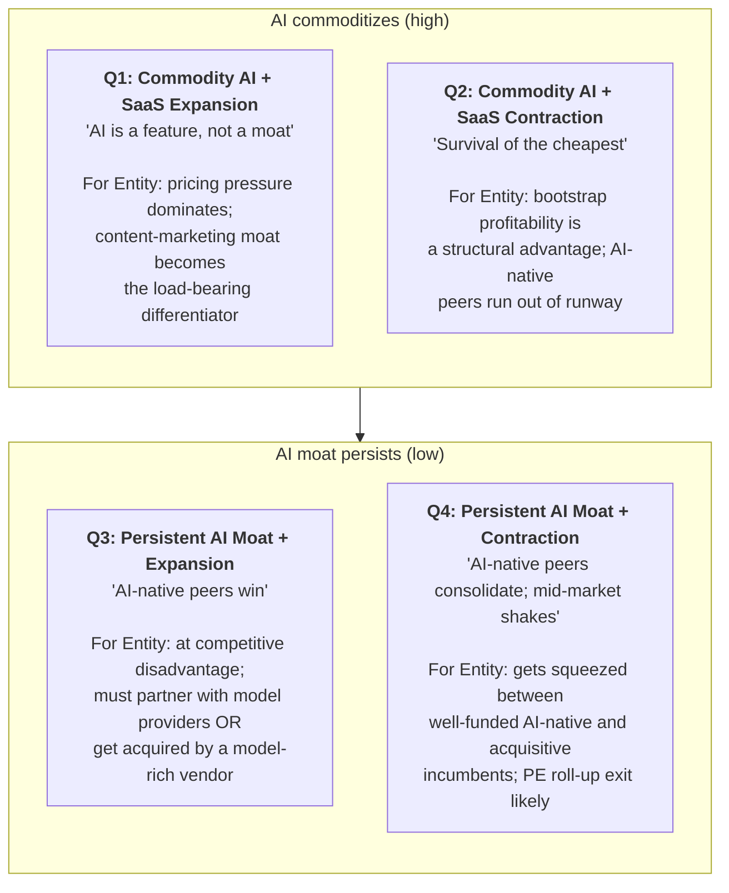

# Scenario Planning + Cone of Plausibility

Loaded by the `research-entity` skill at Step 4 (Draft) when `--scenarios=` is set OR auto-activated for `--type=due-diligence|investment` with `--depth=deep`. Implements two canonical futures-thinking methodologies for forward-looking analysis: the **Royal Dutch Shell scenario-planning method** (2x2 axes) and **Hancock & Bezold's Cone of Plausibility**.

These methodologies fill the "what does this look like in 3-5 years?" gap that strategic dossier readers (board, IC, M&A committee) always raise — and that point-estimate forecasts systematically fail to address.

## Why scenario planning belongs in a dossier

Single-point forecasts ("we expect <entity> to grow X% in 20YY") are systematically wrong for entities operating in high-uncertainty environments. Scenario planning replaces the false-certainty single-point forecast with a **set of plausible futures**, each with its own internal logic and indicators.

Royal Dutch Shell pioneered this in the 1970s ([Pierre Wack's HBR article, 1985](https://hbr.org/1985/09/scenarios-uncharted-waters-ahead)) and famously anticipated the 1973 oil shock when point-forecasters didn't. The technique is now standard in corporate strategy (McKinsey, BCG) and intelligence (CIA Tradecraft Primer's "Multiple Scenarios Generation" SAT).

## Method 1: 2x2 Scenario Matrix (Shell / GBN method)

### The 5-step procedure

1. **Identify the focal question** — the strategic decision the dossier is informing (e.g., "Should we invest in / acquire / partner with Entity X over the next 3 years?")

2. **List driving forces** — 8-12 forces shaping the entity's environment (regulatory, technology, customer, capital, competition, geopolitics)

3. **Identify the 2 most uncertain + most impactful axes** — the dimensions where (a) we genuinely can't predict the outcome and (b) the outcome materially changes the strategy

4. **Build the 2x2 grid** — 4 scenarios at each combination of (Axis 1 high/low) × (Axis 2 high/low); name each scenario evocatively

5. **Develop each scenario** — internal narrative logic, leading indicators, strategic implications

### Output template (insert as §17.X)

````markdown
### 17.X Scenario Analysis (2x2 Matrix)

Per the Royal Dutch Shell / Global Business Network scenario method.

**Focal question**: <e.g., "Should we acquire <entity> over the next 18-24 months?">

**Time horizon**: 3-5 years from <today's date>

**The 2 driving axes** (most-uncertain + most-impactful):

- **Axis 1: <e.g., AI commoditization speed>** — high (LLMs become utility infrastructure by 2027, no AI moat anywhere) / low (model providers consolidate, AI-native vendors retain edge)
- **Axis 2: <e.g., SaaS spending macro>** — expansion (CFO "do more with more" 2026-2028) / contraction (recession-driven consolidation 2026-2028)

#### The 4 scenarios



#### Per-scenario detail

**Scenario Q1 — Commodity AI + SaaS Expansion**:
- *Internal logic*: GPT-5/Claude-5/Gemini-3 commoditize generative AI; LLM access drops to ~$0.10/M-tokens by 2027; CFO buyer "do more with more" continues
- *Leading indicators (12-mo signposts)*: model API prices ↓ 50%+; named "AI-CRM" category disappears from analyst reports; G2 "AI" badge becomes default not differentiator
- *Probability estimate (ICD 203)*: **likely** (55-80%)
- *Strategic implication for evaluator*: Entity wins on content + brand + retention; AI-native peers win on growth — buy if portfolio needs steady-state mid-market exposure
- *What would have to be true*: model providers don't price-gouge; open-weights models continue improving

**Scenario Q2 — Commodity AI + SaaS Contraction**: [similar structure]
**Scenario Q3 — Persistent AI Moat + Expansion**: [similar structure]
**Scenario Q4 — Persistent AI Moat + Contraction**: [similar structure]

#### Cross-scenario decision robustness

| Strategy | Q1 | Q2 | Q3 | Q4 | Robustness |
|---|:-:|:-:|:-:|:-:|---|
| Buy Entity at $30M+ | ✅ | ✅ | ❌ | ❌ | 50% (Q1+Q2 only) |
| Partner not acquire | ✅ | ✅ | ✅ | ✅ | 100% (robust) |
| Pass | ❌ | ❌ | ✅ | ⚠️ | 38% (Q3 only clear) |

**Robust strategies** (work across all/most scenarios) are preferred to high-payoff-narrow-scenario strategies.
````

## Method 2: Cone of Plausibility (Hancock & Bezold)

When 2x2 oversimplifies (e.g., 3+ orthogonal uncertainties), use the Cone of Plausibility.

### The 4 zones (concentric)

```
                        Wildcard
                   (1% probability,
                    high impact)
                  ___________________
                 /                    \
                / Possible             \
               / (10-20% probability)   \
              /  _____________________   \
             /  /                     \   \
            /  / Plausible              \  \
           /  / (40-60% probability)     \  \
          /  /  __________________        \  \
         /  /  /                  \        \  \
        /  /  / Probable           \        \  \
       /  /  / (60-80% probability) \        \  \
      /  /  /                        \        \  \
     /__/__/__________________________\________\__\
                       Today
```

### Output template (insert as §17.X — alternative to 2x2)

```markdown
### 17.X Cone of Plausibility (3-5 year horizon)

Per Hancock & Bezold's futures methodology — futures fan out from today across 4 zones of decreasing probability + increasing surprise.

**Focal question**: <same as 2x2>

**Time horizon**: 3-5 years from <today>

#### Probable future (60-80%)
"<entity> continues as a profitable mid-market vendor with modest organic growth (~5-10%/yr). AI-native peers either consolidate or extend lead. <entity> remains an attractive PE roll-up target by 20YY."
- *Indicators present today*: $2.25M raised, profitable per founder claim, ISO 27001:2022, 216 Capterra reviews
- *Indicators against*: AI-native cohort raised ~$272.5M; rebrand 2026 introduces uncertainty

#### Plausible futures (40-60% — 2-3 alternatives)
1. **PE roll-up exit by 2027-2028** at 2-3× revenue: Vista or Thoma Bravo bundles into a CRM portfolio
2. **Strategic acquirer (Microsoft / Google) buys for content franchise**: the entity's content-platform audience valued at $50-100M as standalone
3. **Microsoft Dynamics partnership deepens** (already started with mid-2025 Booster): becomes Dynamics-extension vendor; reduces direct competition with Salesforce/HubSpot

#### Possible futures (10-20% — 2-4 alternatives)
1. **Founder succession crisis** (CEO health/departure event) triggers fire-sale at depressed multiple
2. **AI-native peer reverse-acquires <entity>** for the customer base + low-cost engineering region
3. **LLM-vendor lawsuit** (third-party-LLM training-data class action implicates the entity's AI product by extension)
4. **Re-rebrand back to legacy name** after <entity> fails to gain SEO/recognition traction

#### Wildcards (1-5% — 1-3 black swans)
1. **Anthropic acquires for MCP-server case study**: bizarre but possible if MCP standardization needs an exemplar mid-market deployment
2. **EU AI Act enforcement event** triggers vendor-wide compliance overhaul; <entity>'s lightweight team can't absorb cost
3. **Choice Hotels Asia-Pac (anchor customer) churn**: triggers cascading reference-customer losses

#### Strategy implications

For an evaluator, the load-bearing question is: which scenarios does my decision survive in?

- **Buy at $30M+**: survives Probable + Plausible #1; fails Possible #1, #2, #4
- **Partner only**: survives Probable + Plausible all + Possible #2, #3
- **Pass**: survives Probable + Plausible #3; misses upside in Plausible #1, #2

Robust decision: **Partner not acquire** (survives 8 of 11 enumerated futures).
```

## Composability with existing skill features

| Feature | Interaction |
|---|---|
| §17 Decision-tree | Decision tree is single-path; scenarios complement by enumerating multiple paths |
| §17.X ACH (analytic-techniques.md) | ACH evaluates EVIDENCE for past/present hypotheses; scenarios analyze FUTURE possibilities — different time orientations |
| §16 Risks | Risk scan is current-state; scenarios are forward-looking — different temporal scopes |
| §0 Watchlist | Watchlist signals derive from the scenario analysis (each scenario has its own indicators) |
| §23 Confidence | Scenario analysis does NOT inflate the composite score; it adds qualitative depth without false precision |

## When to load this file

- `--scenarios=2x2` or `--scenarios=cone-of-plausibility` or `--scenarios=both` flag set
- `--type=due-diligence|investment` AND `--depth=deep` (auto-activated)
- User asks "what's the 3-year outlook?" / "scenario planning" / "futures analysis" / "what could go wrong/right?"

## Anti-patterns

- ❌ Single-point forecasts ("we expect 15% growth in 2027") — replaces analyst judgment with false precision
- ❌ 2x2 with only 2 scenarios filled in — defeats the purpose; all 4 quadrants must have a coherent narrative
- ❌ Cone with only Probable filled — defeats the purpose; the value is in Plausible / Possible / Wildcard
- ❌ Naming scenarios non-evocatively (e.g., "Scenario 1" vs. "Survival of the cheapest") — evocative names get remembered and discussed
- ❌ Scenarios without leading indicators — each scenario must specify the 12-month signposts that would confirm or refute it
- ❌ Probability assignments without ICD 203 expressed-uncertainty terms (per `analytic-techniques.md`)
