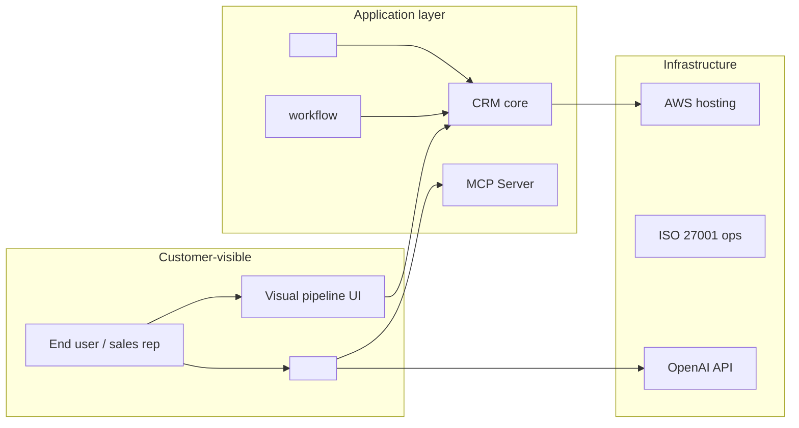

# Strategy Classics — Christensen, Moore, Rumelt, JTBD, Wardley

Loaded by the `research-entity` skill at Step 4 (Draft) when `--framework=` includes `christensen|moore|rumelt|jtbd|wardley|classics|all`. Implements 5 strategic-analysis classics that complement the Porter-era frameworks in `frameworks.md` (PESTEL / 5 Forces / VRIO / Value Chain).

Where Porter-era frameworks describe **industry structure**, these classics describe **innovation dynamics, customer value, and strategic logic** — orthogonal dimensions that strategy-trained readers (McKinsey / BCG / Bain alumni, MBAs, founders) expect to see.

## Supported frameworks

| Framework | Author | Year | Best for |
|---|---|---|---|
| **Disruption Theory** | Clayton Christensen | 1997 (*The Innovator's Dilemma*) | Classifying entity as sustaining vs. disruptive innovator |
| **Crossing the Chasm** | Geoffrey Moore | 1991 | Classifying technology adoption stage (innovators / early adopters / early majority / late majority / laggards) |
| **Strategy Kernel** | Richard Rumelt | 2011 (*Good Strategy / Bad Strategy*) | Diagnosis / Guiding Policy / Coherent Action — alternative to SWOT for synthesis |
| **Job-to-be-Done (JTBD)** | Clayton Christensen / Anthony Ulwick | 2003+ | Customer-need framing; replaces "demographic segmentation" |
| **Wardley Mapping** | Simon Wardley | 2005+ | Strategic-landscape visual — value chain × evolution stage |

## 1. Christensen's Disruption Theory

Source: Christensen, *The Innovator's Dilemma* (HBR Press 1997) + *The Innovator's Solution* (2003).

### The disruption classification

Every innovator falls into one of 3 categories:

| Type | Definition | Threat to incumbents | Examples |
|---|---|---|---|
| **Sustaining** | Improves existing products on dimensions current customers value | Low — incumbents respond effectively | Salesforce Sales Cloud annual feature releases |
| **Low-end disruptive** | Targets over-served customers with simpler, cheaper alternatives; improves over time to encroach on mainstream | High — incumbents ignore initially, lose ground later | HubSpot vs. Salesforce (initially "for SMBs"); Pipedrive vs. enterprise CRM |
| **New-market disruptive** | Targets non-consumption (people not using anything); creates a new market that eventually pulls customers from incumbents | High — incumbents don't see the threat | Salesforce vs. Siebel (cloud vs. on-prem); Notion vs. Confluence |

### Output template (insert as §10.X)

```markdown
### 10.X Disruption Classification (Christensen)

Per Clayton Christensen's *Innovator's Dilemma* — innovators fall into 3 types; the type determines competitive response patterns.

**Classification of <entity>**: <Sustaining / Low-end disruptive / New-market disruptive>

**Evidence supporting classification**:
- <Evidence 1, sourced>
- <Evidence 2, sourced>
- <Evidence 3, sourced>

**Implications**:
- For incumbents (Salesforce / HubSpot / Microsoft Dynamics): <how they should respond>
- For investors: <whether the disruption thesis is durable>
- For acquirers: <whether the entity's trajectory is "asymptote toward incumbent" or "discontinuity">

**Counter-evidence (Devil's Advocate)**:
- <Evidence that the entity is NOT actually a disruptor>
- <Most-likely "wrong classification" scenario>

**Worked example — <entity> classification**:
<entity> is a **sustaining innovator** in the established mid-market CRM category. It improves existing CRM dimensions (visual pipeline, AI assistant, integrations) without targeting non-consumption or over-served customers. The MCP server is sustaining (table-stakes catch-up), not disruptive. **Implication**: incumbents (Salesforce/HubSpot) will respond effectively over time; <entity> competes on positioning + content + service rather than disruption. AI-native peers (Aurasell, Reevo) are the disruptors targeting "non-consumption of agentic CRM" — <entity> is on the defensive, not offensive, side of disruption.
```

## 2. Crossing the Chasm (Geoffrey Moore)

Source: Moore, *Crossing the Chasm* (HarperBusiness 1991, revised 1999, 2014). Refines Rogers' diffusion-of-innovation curve for technology products.

### The 5 adoption groups + 2 chasms

```
Innovators (2.5%) → CHASM 1 → Early Adopters (13.5%) → CHASM 2 → Early Majority (34%) → Late Majority (34%) → Laggards (16%)
   "Tech enthusiasts"        "Visionaries"                      "Pragmatists"                    "Conservatives"           "Skeptics"
```

The CHASM 2 (between Early Adopters and Early Majority) is where 80% of B2B tech companies fail.

### Output template (insert as §10.X)

```markdown
### 10.X Technology Adoption Stage (Moore — Crossing the Chasm)

Per Geoffrey Moore's *Crossing the Chasm* — the technology-adoption-lifecycle position determines GTM motion + buyer expectations.

**Classification of <entity>'s position**:

| Adoption stage | Customer profile | <Entity>'s evidence | Position |
|---|---|---|---|
| Innovators (2.5%) | Tech enthusiasts; will try anything new | n/a | ❌ behind |
| Early Adopters (13.5%) | Visionaries seeking competitive advantage | <entity> was here ~prior years | ✅ past |
| **Early Majority (34%)** | Pragmatists; need references + ecosystem | **<entity> is here today** | ✅ **current** |
| Late Majority (34%) | Conservatives; need standardization + commoditization | not yet | — |
| Laggards (16%) | Skeptics; need extreme cost or compliance pressure | not yet | — |

**Crossed CHASM 1 (innovators → early adopters)**: ✅ ~prior years, when the entity's AI product launched
**Crossed CHASM 2 (early adopters → early majority)**: ✅ ~2018-2020, evidenced by 200+ Capterra reviews + named-customer logo wall
**Currently navigating**: well within Early Majority; primary risk is being LEAPFROGGED by AI-native disruptors that target a different customer segment (the "AI-native CRM Early Adopter" cohort that doesn't yet exist at scale)

**GTM implications**:
- **<entity>'s Early Majority customers** want: ✅ proven references (98 FeaturedCustomers), ✅ ecosystem (200+ integrations), ✅ standards (ISO 27001:2022), ⚠️ complete-product (some gaps: SOC 2, BYOK)
- **Risk**: AI-native peers may define a NEW "AI-CRM Early Adopter" market that pulls <entity>'s Early Majority customers DOWNWARD into their own Early Adopter segment
```

## 3. Rumelt's Strategy Kernel

Source: Rumelt, *Good Strategy / Bad Strategy* (Crown Business 2011).

### The 3-part kernel

Every good strategy must have:

1. **Diagnosis** — clear identification of the central challenge (NOT a list of goals; ONE pivotal problem)
2. **Guiding Policy** — overall approach to overcoming the challenge (NOT tactics; HOW the analyst prescribes responding)
3. **Coherent Action** — concrete steps that work together to advance the policy (NOT a wishlist; INTERLOCKING moves)

### Why this beats SWOT for synthesis

SWOT lists strengths/weaknesses/opportunities/threats — but doesn't FORCE the analyst to identify which 1-2 things matter most. Rumelt's Strategy Kernel forces synthesis: out of all the analysis, what's the PIVOTAL diagnosis?

### Output template (insert as §17.Y — alternative to SWOT-only synthesis)

```markdown
### 17.Y Strategy Kernel (Rumelt)

Per Richard Rumelt's *Good Strategy / Bad Strategy* — the 3-part kernel forces synthesis where SWOT lists.

#### Diagnosis (the central challenge)

**For <entity>**: <ONE-sentence diagnosis identifying the pivotal challenge>

Example: "<entity>'s central challenge is that AI-native peers raised ~$272.5M cumulatively to define a new 'AI-CRM' category before <entity>'s installed base + content moat can be productized as a defensible standalone."

**What the diagnosis is NOT**:
- A list of all challenges (PESTEL covers that)
- A goal statement ("be the leading mid-market CRM")
- A description of the entity (BLUF covers that)

The diagnosis is the SINGLE most-important problem the entity faces.

#### Guiding Policy (the approach)

**For <entity>**: <How would you respond to the diagnosed challenge?>

Example: "**Pivot the entity's content franchise from CRM-bundled-content into a standalone professional-development SaaS**, monetized per-seat distinct from the CRM. Use the rebrand as cover to reposition <entity> as a 'two-platform play' (CRM + Knowledge), making the AI-native peer category-creation comparison less relevant."

**What the guiding policy is NOT**:
- A list of initiatives ("build AI, expand to APAC, hire CMO")
- A vision statement ("become the leader")
- Tactical details

The guiding policy is the OVERALL approach — the bridge between diagnosis and action.

#### Coherent Action (the interlocking moves)

**For <entity>**: <3-5 concrete moves that work together>

Example:
1. **Q1 2027**: Launch the entity's content franchise as a $X/seat/mo standalone subscription distinct from CRM
2. **Q2 2027**: Hire a Knowledge-Product PM and contributor-relations managers for the content franchise
3. **Q3 2027**: Re-pitch <entity> to analyst firms (Gartner, Forrester) as "Sales Development Platform" (new category) rather than "CRM" (commoditizing category)
4. **Q4 2027**: Co-marketing partnership with 1 AI-native CRM peer (e.g., HubSpot/MS Dynamics) where <entity>'s content franchise drives top-of-funnel for the partner CRM
5. **Q1 2028**: Public ARR disclosure to credibilize the "two-platform" valuation thesis

**What coherent action is NOT**:
- A laundry list (5 unrelated initiatives)
- Unconnected goals
- Wishful thinking ("be more agile")

Coherent actions INTERLOCK — each supports the others; together they advance the guiding policy.
```

## 4. Job-to-be-Done (JTBD)

Source: Christensen + Anthony Ulwick (Strategyn). Reframes "what does the customer want?" as "what JOB are they hiring the product to do?"

### The JTBD framework

Customers don't buy products; they "hire" products to do a JOB. The job has 3 dimensions:

1. **Functional** — the practical task ("close more deals")
2. **Emotional** — how the customer wants to feel ("feel in control of my pipeline")
3. **Social** — how the customer wants to be perceived ("look organized to my manager")

### Output template (insert as §9.X — alternative to demographic-segmentation analysis)

```markdown
### 9.X Job-to-be-Done Analysis

Per Christensen / Ulwick — customers don't buy products by demographic; they "hire" products to do a JOB.

#### Primary jobs <entity>'s customers hire it to do

| Job (Functional) | Emotional | Social | Evidence |
|---|---|---|---|
| "Close more deals predictably" | Confidence in pipeline accuracy | Look like a competent VP-Sales | Per Capterra reviews + case studies |
| "Onboard new sales reps faster" | Reduce cognitive overhead of new tools | Look like a forward-thinking team | Per ease-of-use 4.6 rating |
| "Replace [Salesforce/HubSpot] without migration pain" | Feel relief from sunk-cost lock-in | Justify replacement to the board | Per "70% TCO claim" + Headworks International testimonial ("easier than Salesforce") |
| "Develop my sales team's skills, not just track them" | Pride in team development | Position as a coach, not a tracker | Per <entity> positioning + content-library access |

#### Jobs <entity> is NOT hired for

| Job NOT served | Why | Implication |
|---|---|---|
| "Run an enterprise sales org with 500+ reps" | Insufficient scale, no SOC 2 | Cedes enterprise to Salesforce |
| "AI-first deal coaching with autonomous agents" | <entity-AI-product> is sustaining, not agentic | Cedes "AI-first sales coach" to AI-native peers |
| "Niche-vertical CRM (healthcare/fintech/legaltech-specific)" | Horizontal positioning | Cedes vertical-CRM to Veeva/Athena/Clio |

#### Strategic implications

The job <entity> is best at — "develop my sales team's skills, not just track them" — is a UNIQUE position. No incumbent (Salesforce/HubSpot/Microsoft) and no AI-native peer is hired for this job. This is the load-bearing strategic moat — but only if the the entity's content franchise is productized as a standalone subscription.
```

## 5. Wardley Mapping

Source: Simon Wardley, *Wardley Maps* (free CC-BY-SA, 2018+). Visual strategic-landscape mapping — value chain on Y-axis × evolution stage on X-axis.

### The map

```
Customer  │
  ↑       │   [Visible Need]
Visibility│         │
          │      [Component A]──┬──[Component B]
          │            │         │       │
          │      [Component C]   │       │
          │            │         │   [Component D]
          │            │         │       │
          │      [Component E]   │       │
  ↓       │            │         │       │
Invisible │      [Component F]───┴───[Component G]
          └────────────┴─────────┴───────┴──────────────→
              Genesis    Custom    Product   Commodity
                                    /Rental
                            (Evolution stage →)
```

- **Y-axis (visibility)**: how visible the component is to the end-user (top = customer-facing; bottom = infrastructure)
- **X-axis (evolution)**: stage of evolution — Genesis (novel) / Custom-built / Product/Rental / Commodity

Strategic value comes from understanding which components are at which stage — and where to invest (genesis components for differentiation; commodity components for cost minimization).

### Output template (insert as §10.X for `--framework=wardley`)

```markdown
### 10.X Wardley Map (Strategic Landscape)

Per Simon Wardley's *Wardley Maps* method — the entity's value chain plotted across evolution stages reveals where to invest (genesis-stage = differentiation) vs. where to commoditize (commodity-stage = cost).



**Per-component evolution placement**:

| Component | Evolution stage | Strategic implication |
|---|---|---|
| Visual pipeline UI | Product/Rental (mature) | Defensible UX advantage; protect, don't reinvent |
| CRM core | Commodity (mature) | Compete on price/integrations, not features |
| <entity-AI-product> | Custom-built (transitioning to Product) | Will commoditize within 12-24 months as LLM APIs commoditize |
| MCP Server | Genesis (novel) → Custom-built (catching up) | Was a differentiator opportunity; lost to HubSpot/MS/SF first-movers |
| <entity-content-product> | **Genesis (novel)** | **Most-defensible differentiation; unique in CRM landscape** |
| <entity-automation-feature> | Product/Rental | Standard SaaS feature; not differentiating |
| AWS hosting | Commodity | Cost-minimize; switch providers if better deal |
| ISO 27001 ops | Custom-built (becoming Product) | Compliance is becoming table-stakes |
| OpenAI API dependency | Custom-built (rapidly commoditizing) | Switch to multi-provider before lock-in deepens |

**Strategic recommendation**: Invest in the content-marketing component (genesis stage = highest defensibility upside). Commoditize hosting + LLM provider (commodity stage = cost minimization). Maintain entity-AI-product + Visual UI (product stage = competitive parity). Acknowledge MCP Server lost first-mover advantage; pivot to depth-of-MCP-integration as the differentiator.

**Per Wardley**: "Map the landscape before you make a strategy." The map reveals what's defensible vs. what's commodity — investing in the wrong stage destroys value.
```

## Composability with frameworks.md

| Frameworks.md (Porter-era) | strategy-classics.md (this file) |
|---|---|
| SWOT (Stanford 1960s) | — |
| PESTEL (Aguilar 1967) | — |
| Porter's 5 Forces (1980) | Christensen Disruption (1997) — orthogonal |
| VRIO (Barney 1995) | Rumelt Strategy Kernel (2011) — synthesis |
| Value Chain (Porter 1985) | Wardley Mapping (2005+) — evolution-aware refinement |
| — | Crossing the Chasm (Moore 1991) |
| — | JTBD (Christensen / Ulwick 2003+) |

`--framework=all` activates BOTH files. `--framework=classics` activates ONLY this file. `--framework=swot,christensen,wardley` is also valid.

## When to load this file

- `--framework=` includes `christensen|moore|rumelt|jtbd|wardley|classics|all`
- `--type=investment` (auto-loads JTBD + Christensen for thesis articulation)
- `--type=due-diligence` AND `--depth=deep` (auto-loads Strategy Kernel)
- Audience is McKinsey / BCG / Bain / startup founders / MBA-trained
- User asks "is this a disruptor?" / "where in the adoption curve?" / "what's the strategy?" / "JTBD" / "Wardley map"

## Anti-patterns

- ❌ Christensen classification without source-evidence — "this is disruptive" is meaningless without the case for low-end vs. new-market
- ❌ Moore Chasm placement without referent customer evidence — placing in Early Majority requires actual customer-mix analysis
- ❌ Rumelt Strategy Kernel with multiple diagnoses — defeats the purpose; the kernel demands ONE central challenge
- ❌ JTBD analysis with only Functional dimension — emotional + social are equally load-bearing
- ❌ Wardley Map with all components at the same evolution stage — means the analysis didn't discriminate; revisit
- ❌ Using strategy classics to "sound smart" without applying them rigorously — McKinsey/BCG-trained readers detect superficial application immediately
